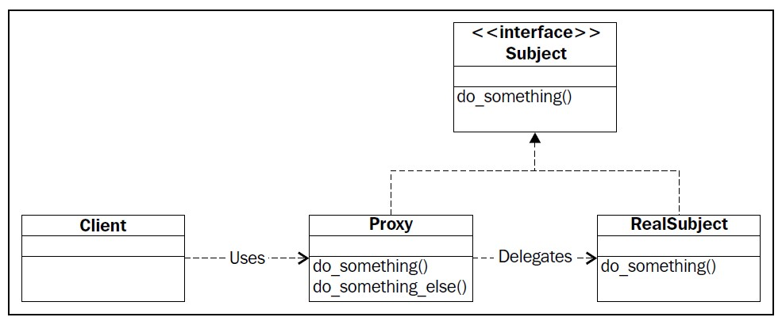

# Proxy Pattern
## Main Ideas
- It's used for heavy objects that would easily fill up primary memory, for that reason it's better
to create that object only once in a runtime, and reuse it, for me it looks like a singleton.
- Both Proxy and RealSubject inherit from the same object, they implement the same interface,
the difference is that proxy contains a reference to real-object and within every inherited method calls the real-object method.



## Test

> `$ python main.py`
```
Created new object
Count of references =  1

Using cached object
Count of references =  2

Using cached object
Count of references =  3

Called sort method with args:
[('self', <classes.Proxy.Proxy object at 0x7f15fae0c650>), ('reverse', True)]

Deleting proxy2
Deleted object. Count of objects =  2
Deleted object. Count of objects =  1
Number of reference_count is 0. Deleting cached object...
Deleted object. Count of objects =  0

Created new object
Count of references =  1

Called sort method with args:
[('self', <classes.Proxy.Proxy object at 0x7f15fae0c810>), ('reverse', True)]

The other objects are deleted upon program termination
Number of reference_count is 0. Deleting cached object...
Deleted object. Count of objects =  0

```